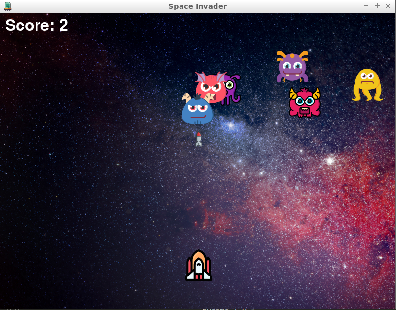

# Space Invader Game

This is a simple game in Python I've programmed based on the youtube tutorial [Pygame Tutorial for Beginners - Python Game Development Course](https://www.youtube.com/watch?v=FfWpgLFMI7w).



## Running

**1. In the _project root directory_ just run the command:**

```bash
$ python3 main.py
```
## Python code

```python
import pygame
import random

"""
 Initialize the pygame
"""
pygame.init()

"""
Game Constants
"""
GAME_IMAGE_PATH = "images/"
GAME_SOUNDS_PATH = "sounds/"
GAME_TITLE = "Space Invader"
GAME_WIDTH = 800
GAME_HEIGHT = 600
GAME_TITLE_IMG = "{0}ufo.png".format(GAME_IMAGE_PATH)
GAME_BLACK_COLOR = (0, 0, 0)
GAME_BACKGROUND_IMG = "{0}background.jpg".format(GAME_IMAGE_PATH)
GAME_BACKGROUND_MUSIC = "{0}background.ogg".format(GAME_SOUNDS_PATH)
GAME_SCORE = 0
GAME_SCORE_X_POSITION = 10
GAME_SCORE_Y_POSITION = 10
GAME_FONT = pygame.font.Font("freesansbold.ttf", 32)

"""
Player Constants
"""
PLAYER_IMG = "{0}player.png".format(GAME_IMAGE_PATH)
PLAYER_SIZE = 64
PLAYER_X_CHANGE_VALUE = 5
PLAYER_Y_CHANGE_VALUE = 2.5

"""
Enemy Constants
"""
ENEMY_X_CHANGE_VALUE = 2
NUMBER_OF_ENEMIES = 6
ENEMY_MUSIC = "{0}explosion.ogg".format(GAME_SOUNDS_PATH)

"""
Bullet Constants
"""
BULLET_IMG = "{0}bullet.png".format(GAME_IMAGE_PATH)
BULLET_MUSIC = "{0}laser.ogg".format(GAME_SOUNDS_PATH)

# Caption and Icon
pygame.display.set_caption(GAME_TITLE)
pygame.display.set_icon(pygame.image.load(GAME_TITLE_IMG))

# Create the screen
screen = pygame.display.set_mode((GAME_WIDTH, GAME_HEIGHT))

# Background
background = pygame.image.load(GAME_BACKGROUND_IMG)

# Function to play music
def play_music(music, loop):
    pygame.mixer.music.load(music)
    pygame.mixer.music.play(loop)


# Function to play sound
def play_sound(music):
    sound = pygame.mixer.Sound(music)
    # sound.play()


# Background Sound
play_music(GAME_BACKGROUND_MUSIC, -1)

# Player
playerImg = pygame.image.load(PLAYER_IMG)
# Player horizontal position
player_X_position = 370
player_X_position_change = 0

# Player vertical position
player_Y_position = 480
player_Y_position_change = 0

# Enemies lists
enemies = []
enemies_X_position = []
enemies_Y_position = []
enemies_X_position_change = []
enemies_Y_position_change = []

# Create the enemies
for i in range(NUMBER_OF_ENEMIES):
    enemyImg = "{0}enemy_{1}.png".format(GAME_IMAGE_PATH, i)
    enemies.append(pygame.image.load(enemyImg))
    enemies_X_position.append(random.randint(0, 735))
    enemies_Y_position.append(random.randint(50, 150))
    enemies_X_position_change.append(2)
    enemies_Y_position_change.append(20)

# Bullet
# ready - You can't see the bullet on the screen
# fire - The bullet is currently moving
bulletImg = pygame.image.load(BULLET_IMG)
bullet_X_position = 0
bullet_Y_position = 480
bullet_X_position_change = 0
bullet_Y_position_change = 10
bullet_state = "ready"


def set_score_text(x, y):
    score = GAME_FONT.render("Score: {0}".format(GAME_SCORE), True, (255, 255, 255))
    screen.blit(score, (x, y))


def set_player_at(x, y):
    screen.blit(playerImg, (x, y))


def fire_bullet_at(x, y):
    global bullet_state

    bullet_state = "fire"
    screen.blit(bulletImg, (x + 16, y + 10))


def handle_keydown_event(eventType, eventKey):
    global player_X_position, player_X_position_change, player_Y_position_change, bullet_state, bullet_X_position, bullet_Y_position

    # if keystroke is pressed check whether its right or left
    if eventType == pygame.KEYDOWN:
        if eventKey == pygame.K_LEFT:
            player_X_position_change = -PLAYER_X_CHANGE_VALUE
        if eventKey == pygame.K_RIGHT:
            player_X_position_change = PLAYER_X_CHANGE_VALUE
        if eventKey == pygame.K_UP:
            player_Y_position_change = -PLAYER_Y_CHANGE_VALUE
        if eventKey == pygame.K_DOWN:
            player_Y_position_change = PLAYER_Y_CHANGE_VALUE
        if eventKey == pygame.K_SPACE:
            if bullet_state is "ready":
                play_sound(BULLET_MUSIC)
                # Get current x cordinate of the spaceship
                bullet_X_position = player_X_position
                bullet_Y_position = player_Y_position
                fire_bullet_at(bullet_X_position, bullet_Y_position)

    # if keystroke is released don't change the players position
    if eventType == pygame.KEYUP:
        if (
            eventKey == pygame.K_LEFT
            or eventKey == pygame.K_RIGHT
            or eventKey == pygame.K_DOWN
            or eventKey == pygame.K_UP
        ):
            player_X_position_change = 0
            player_Y_position_change = 0


def change_player_X_position():
    global player_X_position, player_X_position_change

    player_X_position += player_X_position_change
    if player_X_position <= 0:
        player_X_position = 0
    elif player_X_position >= (GAME_WIDTH - PLAYER_SIZE):
        player_X_position = GAME_WIDTH - PLAYER_SIZE


def change_player_Y_position():
    global player_Y_position, player_Y_position_change

    player_Y_position += player_Y_position_change
    if player_Y_position <= 0:
        player_Y_position = 0
    elif player_Y_position >= (GAME_HEIGHT - PLAYER_SIZE):
        player_Y_position = GAME_HEIGHT - PLAYER_SIZE


def move_bullet():
    global bullet_Y_position, bullet_Y_position_change, bullet_state, player_X_position

    if bullet_Y_position <= 0:
        bullet_Y_position = 480
        bullet_state = "ready"

    if bullet_state is "fire":
        fire_bullet_at(player_X_position, bullet_Y_position)
        bullet_Y_position -= bullet_Y_position_change


"""
ENEMY LOGIC
"""


def set_enemy_at(x, y, i):
    global enemies
    screen.blit(enemies[i], (x, y))


def calculate_distance(x1, x2, y1, y2):
    # Calculate the differences
    x = x1 - x2
    y = y1 - y2

    # Square the differences
    x = x ** 2
    y = y ** 2

    # Return the square root
    return (x + y) ** (1 / 2)


def isCollision(
    enemy_X_position, enemy_Y_position, bullet_X_position, bullet_Y_position
):
    distance = calculate_distance(
        enemy_X_position, bullet_X_position, enemy_Y_position, bullet_Y_position
    )

    if distance < 27:
        return True
    else:
        return False


def change_enemy_position(i):
    global enemies_X_position, enemies_Y_position

    enemies_X_position[i] = random.randint(0, 735)
    enemies_Y_position[i] = random.randint(50, 150)


def move_enemy():
    global enemies_X_position, enemies_X_position_change, enemies_Y_position, enemies_Y_position_change, bullet_Y_position, bullet_state, GAME_SCORE

    # Enemies Movement
    for i in range(NUMBER_OF_ENEMIES):
        enemies_X_position[i] += enemies_X_position_change[i]

        if enemies_X_position[i] <= 0:
            enemies_X_position_change[i] = ENEMY_X_CHANGE_VALUE
            enemies_Y_position[i] += enemies_Y_position_change[i]
        elif enemies_X_position[i] >= (GAME_WIDTH - PLAYER_SIZE):
            enemies_X_position_change[i] = -ENEMY_X_CHANGE_VALUE
            enemies_Y_position[i] += enemies_Y_position_change[i]

        # Collision
        collision = isCollision(
            enemies_X_position[i],
            enemies_Y_position[i],
            bullet_X_position,
            bullet_Y_position,
        )
        if collision:
            bullet_Y_position = player_Y_position
            bullet_state = "ready"
            GAME_SCORE += 1
            change_enemy_position(i)
            play_sound(ENEMY_MUSIC)

        set_enemy_at(enemies_X_position[i], enemies_Y_position[i], i)


"""
GAME LOOP INIT
"""
running = True
while running:

    # RGB - Red, Green, Blue
    screen.fill(GAME_BLACK_COLOR)

    # Background Image
    screen.blit(background, (0, 0))

    for event in pygame.event.get():
        if event.type == pygame.QUIT:
            running = False
        else:
            handle_keydown_event(
                event.type, (event.key if hasattr(event, "key") else None)
            )  # if keystroke is pressed check whether its right or left

    # Change player X position
    change_player_X_position()

    # Change player Y position
    change_player_Y_position()

    # Enemy Movement
    move_enemy()

    # Bullet Movement
    move_bullet()

    # Update player and enemy positions
    set_player_at(player_X_position, player_Y_position)
    set_score_text(GAME_SCORE_X_POSITION, GAME_SCORE_Y_POSITION)
    pygame.display.update()
```


## References

[Pygame Tutorial for Beginners - Python Game Development Course](https://www.youtube.com/watch?v=FfWpgLFMI7w)

[Python](https://www.python.org/)

[Flaticon](https://www.flaticon.com/)

# License

Please see the [license agreement](https://github.com/martha-locks/gamemartha-rafa/blob/main/LICENSE).
